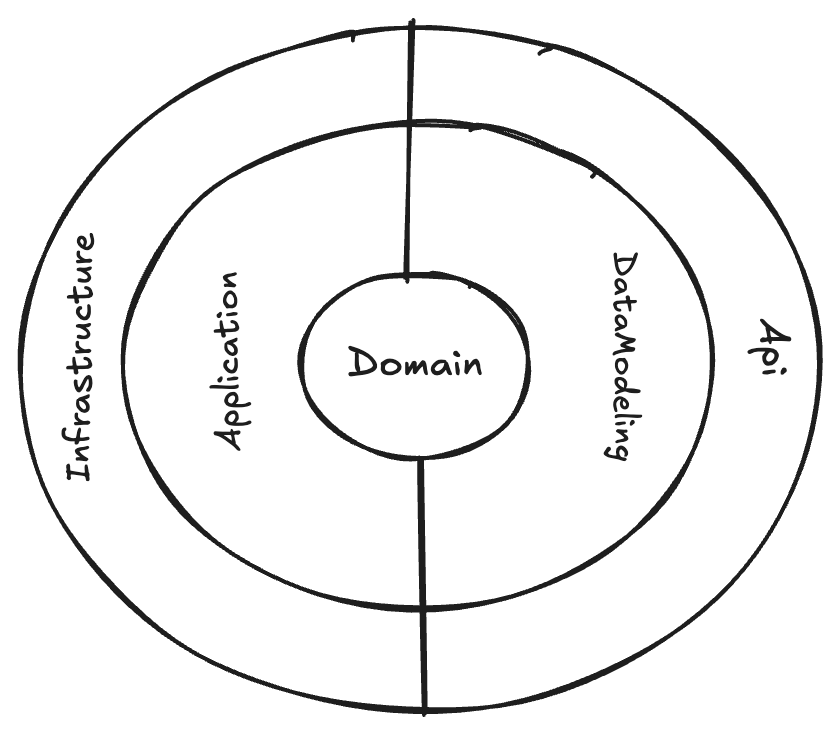

# Tournament Planner

A flexible tournament planning application built with Clean Architecture and minimal external dependencies.

## Philosophy

Core services—mediator, data seeder, email client, and template engine—are custom-built to provide full control and adaptability across any game format.

## Key Features

- **Game-Agnostic**: Supports any game via configuration files—no code changes needed.
- **Tournament Types**: Knockout, group stages, and customizable formats.
- **Lifecycle Management**: Draft → Registration → Ongoing → Completed with enforced workflows.
- **Participant Management**: Player registration, seeding, age limits, and max participant control.
- **Match Scheduling & Draw Generation**: Automated scheduling and draw logic supporting multiple stages.
- **Extensible Architecture**: Easily add new game formats or modify scoring logic.
- **Secure Admin Operations**: Access control enforced for sensitive actions.
- **Minimal Dependencies**: Core services fully implemented in-house.

## Domain Concepts

- **Tournament**: Contains metadata, type, game type, participants, draws, matches, and current status.
- **Match & Draw**: Flexible scheduling logic supporting both group and knockout stages.
- **GameType**: Abstracted, allowing new game formats to be added using minimal configuration.

## Tech Stack

- **Backend**: C# with Clean Architecture, custom mediator, scheduler, and services.
- **Frontend**: Angular for tournament management and visualization.
- **Design Focus**: Extensible, maintainable, and testable architecture with minimal dependencies.

## Getting Started

1. `git clone https://github.com/knightfury16/tournament-planner.git`
2. Restore dependencies.
3. Build and run the backend.
4. Start the Angular frontend.
5. Create tournaments, register players, schedule matches, and manage draws.

## Project Structure

- **Domain**: Entities (Tournament, Player, Match, Draw, GameType)
- **Application**: Core services and business logic
- **Interactor**: Angular frontend for management
- **Infrastructure**: Custom-built data seeder, email client, and template engine

## Contributing

Contributions welcome. Please follow the philosophy: clean code, minimal dependencies, and extensible logic.

## License

[MIT](LICENSE)
